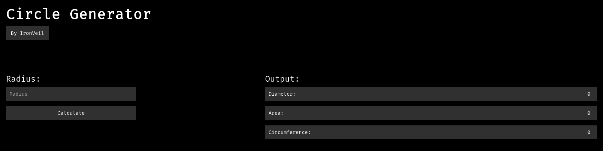

# Circle Calculator

A basic circle calculator written in HTML, SASS and JS. Currently, it can calculate the diameter, area and circumference from the radius. You can visit it [here](https://circlecalculator.netlify.app/).

I might add stuff in the future, not sure what.
